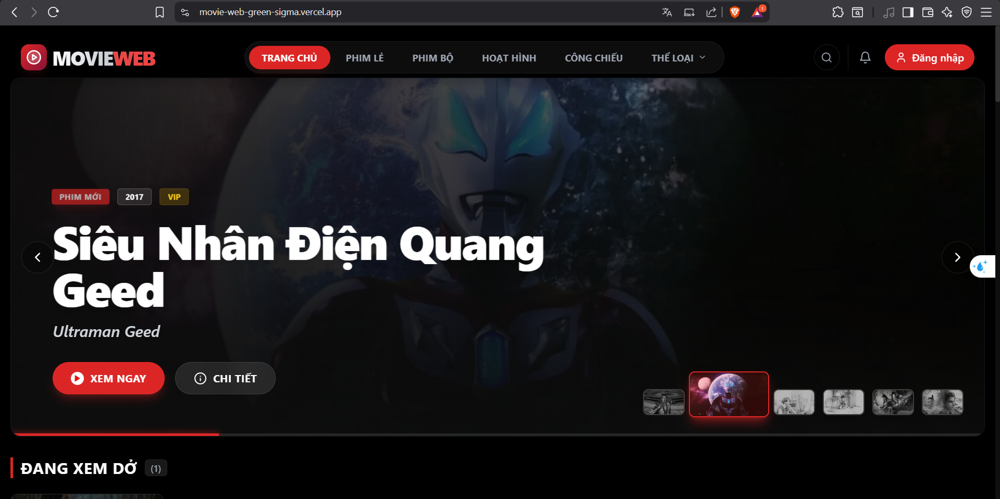

# 🎬 MovieWeb - Next-Gen Streaming Platform

<div align="center">


<p align="center">
  <strong>Trải nghiệm xem phim điện ảnh ngay trên trình duyệt của bạn.</strong><br>
  Tốc độ cao • Không quảng cáo • Giao diện chuẩn Netflix
</p>

[Xem Demo](#) • [Báo Lỗi](https://github.com/minhancr123/movie_web/issues) • [Yêu Cầu Tính Năng](https://github.com/minhancr123/movie_web/issues)

</div>

<div align="center">
  
</div>

---

## � Giới Thiệu

**MovieWeb** là dự án web xem phim trực tuyến hiện đại, được xây dựng với mục tiêu đem lại trải nghiệm mượt mà và cao cấp nhất cho người dùng.
Sử dụng sức mạnh của **Next.js 14 (App Router)** kết hợp với công nghệ streaming **HLS**, dự án giải quyết bài toán tải chậm của các web phim truyền thống.

## 🚀 Tính Năng Nổi Bật (Key Features)

| Tính Năng | Mô Tả | Công Nghệ |
|-----------|-------|-----------|
| **Streaming Thích Ứng** | Tự động chuyển đổi chất lượng (360p/720p/1080p) theo mạng | `HLS.js`, `Adaptive Bitrate` |
| **Intro Điện Ảnh** | Hiệu ứng Animation mở đầu cực "ngầu" kiểu Netflix | `CSS3 Animation`, `Session Storage` |
| **Parallax Banner** | Banner chuyển động 3D theo con trỏ chuột | `React Mouse Event`, `Transform 3D` |
| **Tự Động Lưu** | Tự nhớ chính xác giây đang xem, không cần đăng nhập | `Local Storage Hook`, `Real-time Sync` |
| **Bỏ Qua Intro** | Tự động phát hiện và bỏ qua đoạn mở đầu (90s) | `Video Time Logic` |
| **Picture-in-Picture** | Xem phim cửa sổ nhỏ khi lướt tab khác | `PiP API` |

## 🛠️ Tech Stack (Công Nghệ Sử Dụng)

### Frontend Core
- **Framework**: [Next.js 14](https://nextjs.org/) (App Router, Server Components)
- **Language**: TypeScript (Type-safe toàn diện)
- **Styling**: Tailwind CSS + Animations
- **Icons**: Lucide React

### Video Engineering
- **Player**: HTML5 Video + HLS.js
- **Optimization**: Lazy Loading Resources, Intersection Observer

### Data & State
- **Fetching**: Server Actions / API Routes
- **State**: React Hooks (useContext, useReducer)
- **Persistence**: Custom LocalStorage Hooks

## � Cấu Trúc Dự Án (Project Structure)

```bash
📦 src
 ┣ 📂 app                  # Next.js 14 App Router
 ┃ ┣ 📂 admin              # Trang quản trị (Admin Dashboard)
 ┃ ┣ 📂 api                # API Routes nội bộ
 ┃ ┣ 📂 auth               # Trang đăng nhập/đăng ký
 ┃ ┣ 📂 danh-sach          # Các trang danh sách (Phim lẻ, Phim bộ...)
 ┃ ┣ 📂 history            # Trang lịch sử xem
 ┃ ┣ 📂 phim               # Trang chi tiết phim (Info)
 ┃ ┣ 📂 xem-phim           # Trang xem phim (Player)
 ┃ ┣ 📜 layout.tsx         # Layout chính (Header, Footer)
 ┃ ┣ 📜 page.tsx           # Trang chủ (Homepage)
 ┃ ┗ 📜 globals.css        # Global Styles
 ┣ 📂 components           # UI Components (Reusable)
 ┃ ┣ 📜 VideoPlayer.tsx    # Trình phát video HLS (Core)
 ┃ ┣ 📜 HeroSection.tsx    # Banner Parallax
 ┃ ┣ 📜 MovieCard.tsx      # Thẻ phim thông minh
 ┃ ┣ 📜 IntroAnimation.tsx # Intro hiệu ứng
 ┃ ┗ ...
 ┣ 📂 hooks                # Custom Hooks
 ┃ ┗ 📜 useLocalStorage.ts # Quản lý lịch sử xem
 ┣ 📂 lib                  # Tiện ích (Utils)
 ┃ ┗ 📜 api.ts             # Cấu hình gọi API
 ┗ 📂 types                # TypeScript Definitions
```

## 🗺️ Roadmap Phát Triển

- [x] **Giai đoạn 1: MVP Core**
  - [x] Xây dựng giao diện Responsive (Mobile/PC)
  - [x] Tích hợp API phim, Tìm kiếm
  - [x] Player HLS cơ bản

- [x] **Giai đoạn 2: Nâng cao trải nghiệm (Hiện tại)**
  - [x] Intro Animation & Parallax Banner
  - [x] Tự động lưu lịch sử xem
  - [x] Tính năng "Bỏ qua Intro", "Tự chuyển tập"
  - [x] Tối ưu tốc độ tải (Lazy Load)

- [ ] **Giai đoạn 3: Cộng đồng & Cá nhân hóa (Sắp tới)**
  - [ ] Đánh giá/Rating sao
  - [ ] Gợi ý phim bằng AI
  - [ ] Có các phim có độ phân giải 2k/4k
  - [ ] Đồng bộ lịch sử lên Cloud

## 🔧 Cài Đặt & Chạy Thử (Full-Stack Setup)

### Yêu cầu tiên quyết (Prerequisites)
- [Node.js](https://nodejs.org/) (v18+)
- [.NET SDK](https://dotnet.microsoft.com/download) (v8.0)
- [MongoDB](https://www.mongodb.com/) (Local hoặc Cloud Atlas)

### 1. Khởi chạy Backend (.NET Core)
Đây là API chính xử lý logic nghiệp vụ và dữ liệu phim.

```bash
cd backend
# Cấu hình chuỗi kết nối trong appsettings.json nếu cần
dotnet restore
dotnet watch run
```
*Backend sẽ chạy tại: `http://localhost:5000`*

### 2. Khởi chạy Backend Node.js (Phụ trợ)
Service này xử lý các tác vụ real-time hoặc proxy (nếu có).

```bash
cd backend-node
npm install
npm run dev
```

### 3. Khởi chạy Frontend (Next.js)
Giao diện người dùng chính.

```bash
cd frontend
npm install

# Tạo file .env.local
echo "NEXT_PUBLIC_BACKEND_API_URL=http://localhost:5000" > .env.local
echo "NEXT_PUBLIC_IMAGE_PREFIX=https://phimimg.com/" >> .env.local

npm run dev
```
*Frontend sẽ chạy tại: `http://localhost:3000`*

---


---

<p align="center">
  Made with ❤️ by <strong>Huỳnh Minh An</strong>
</p>
